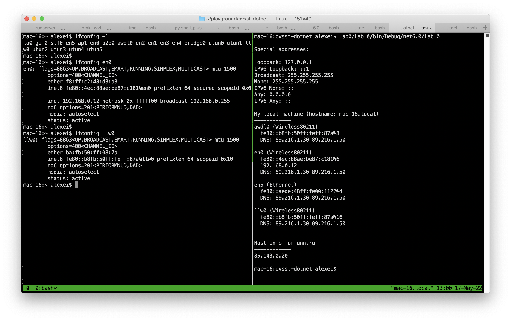

# Lab_0

1. Prints out "special addresses" - ipv4 and ipv6 loopback addresses, "none" and ipv4 broadcast address
2. Prints out all local Ethernet and wireless interfaces with at least one unicast address assigned
3. Prints out host resolution info for unn.ru host

