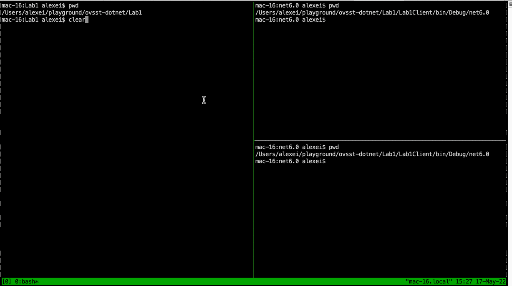
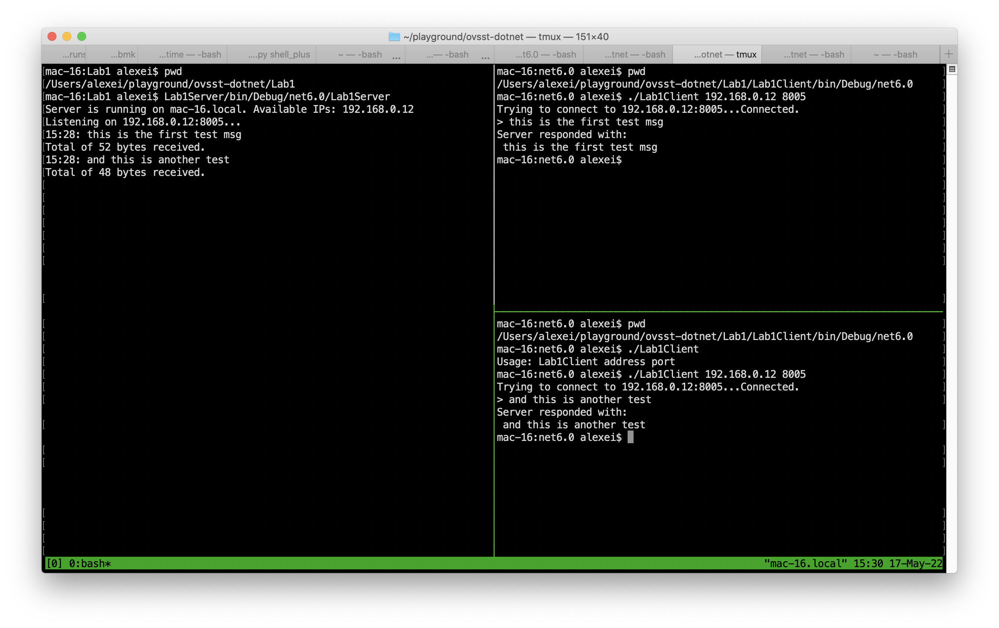

# Lab_1

Simple server and client for socket connection.

Server semi-randomly chooses first available local IP, and listens on port `8005` (fixed). After receiving a message, it just echoes it back. Server is single-threaded.

Client takes 2 params (ip and port), connects to socket, reads a string from console, writes it to socket and reads (and prints) response. Then disconnects. Basically, it's a big copy-paste from the server code, and is pretty much redundant - server can be easily tested with telnet. Some screenshots below.

