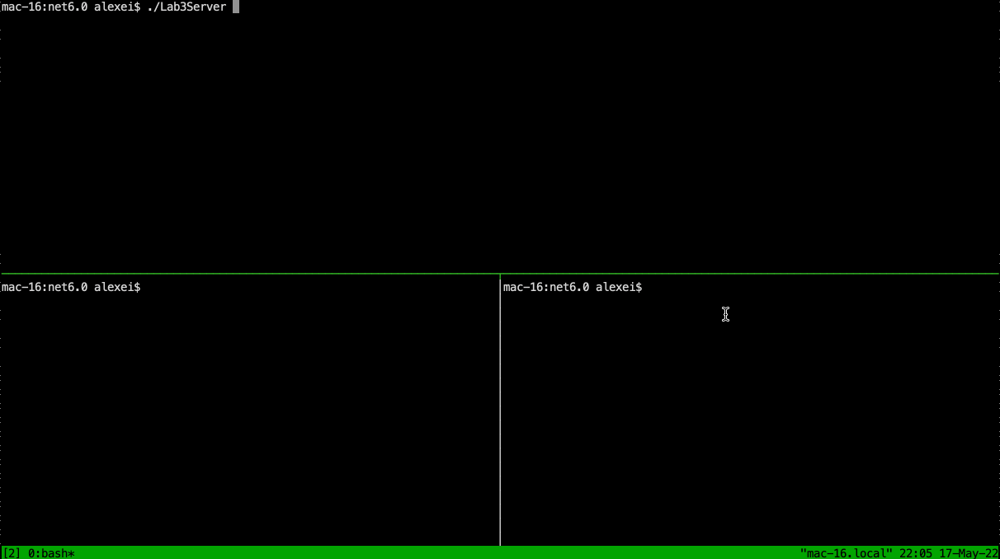

# Lab_3

Multi-threaded implementation of the echo-server (client is 100% identical to [LAB 2](../Lab2)).

Whenever a new connection comes, we start a new thread (with worker function totally similar to the one from Lab 2); when it receives stop word or meets exit condition - worker function exits and terminates the thread.

