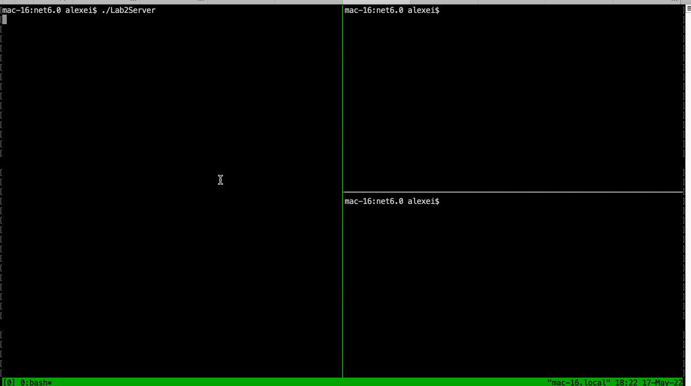

# Lab_2

Simple server and client for socket connection. Server keeps the connection until it receives a stop-word, while other clients are awaiting connection. 

As opposed to Lab 1, server doesn't close the socket connection right away after receiving a message, but keeps reading from the socket until it gets the stop-word; once received, it closes connection.

Client also keeps reading from the socket (once connected) to get server's messages, and also polls the socket to make sure the connection is alive. If not - it forcefully exits.

Both client and server are still single-threaded, meaning that the server serves only one client at a time, and others are waiting.

