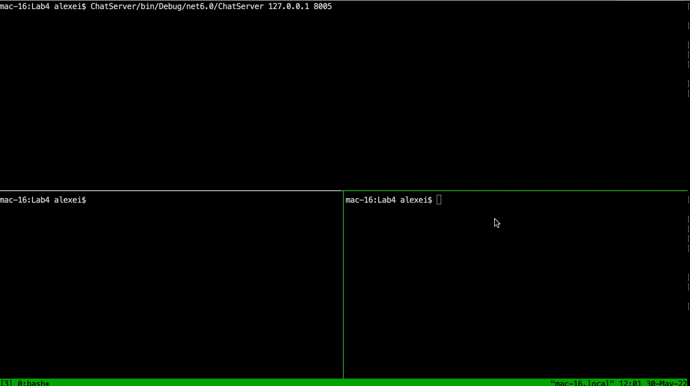

# Lab_4

Chat server / client.

The only difference to the client (perhaps, the most challenging part of the project that took most of the research) is the ability to delete lines from the console. .NET's `Console` methods have very limited support on OSX (e.g. you can't arbitrarily set window size / cursor position, something you can easily do in the Windows environment), and I wanted to avoid developing any UI (which would be a huge ordeal by itself with Mono or alike). So I ended up playing with some escape sequences to manipulate lines in the console. Light years away from being perfect, but still good enough to build a CLI/UI somewhat reminding of the good old times.

For the server part, most of the code is the same. Main difference is that now I maintain a list of workers now, and have whisper/broadcast methods so that whenever we want to pass a message over all sockets (belonging to all workers) - we just iterate over the list, skipping 'our' worker. Each time a worker ends (e.g. client disconnected - by a command or by closing connection) - we remove reference to this worker from the list. 

